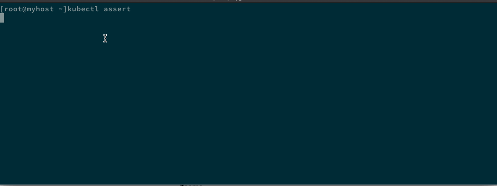

# KubeAssert

[](https://gitter.im/morningspace/community?utm_source=badge&utm_medium=badge&utm_campaign=pr-badge)

[](https://github.com/morningspace/kubeassert/releases)


KubeAssert is designed as a kubectl plugin to provide a set of assertions that can be used to quickly assert Kubernetes resources from the command line against your working cluster. It has been submitted to [krew](https://krew.sigs.k8s.io/) as a kubectl plugin distributed on the centralized [krew-index](https://krew.sigs.k8s.io/plugins/). To install KubeAssert using krew:
```shell
kubectl krew install assert
```

To learn more on KubeAssert, please read the online [documentation](https://morningspace.github.io/kubeassert/docs/#/).


